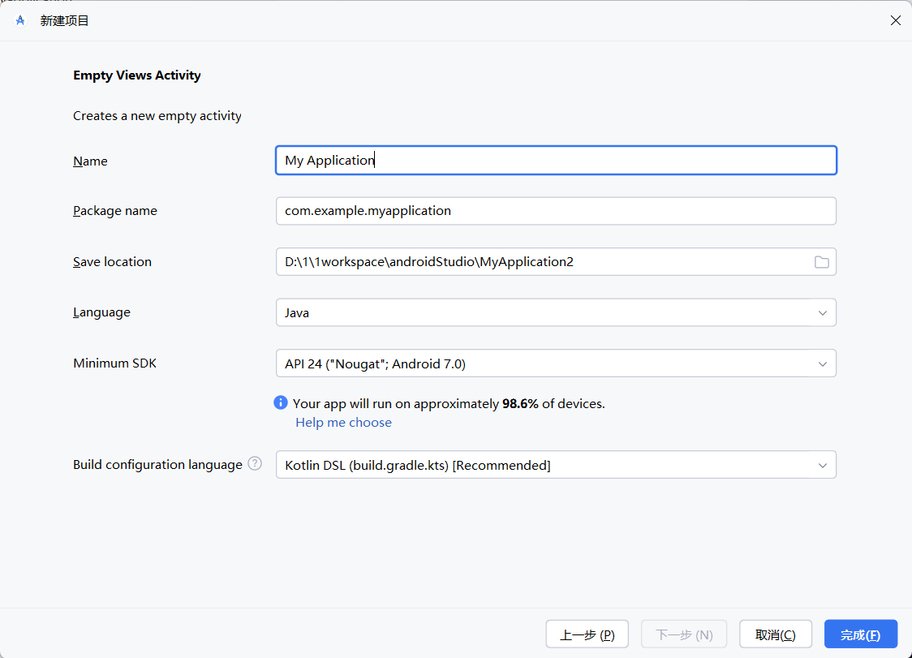
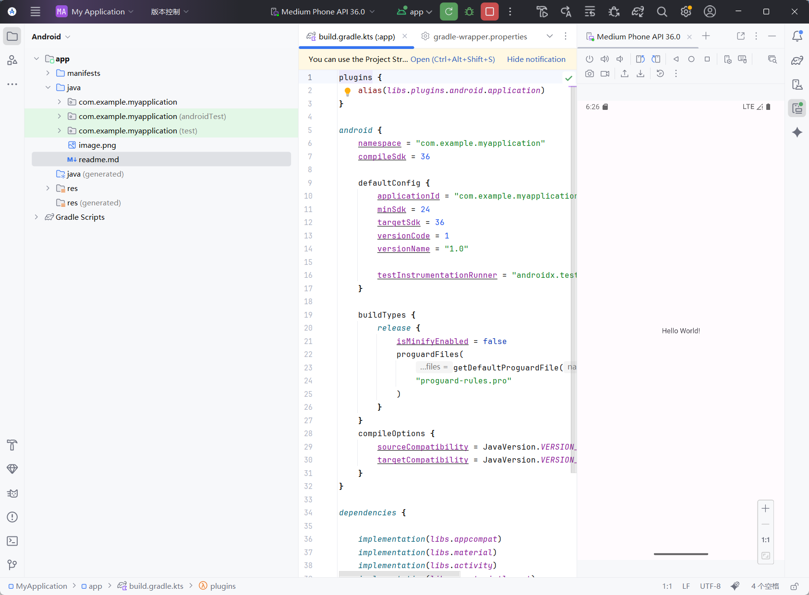
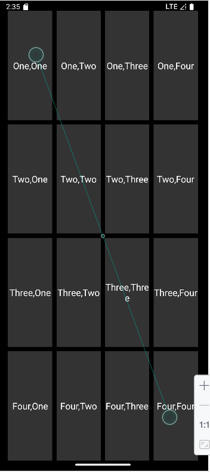
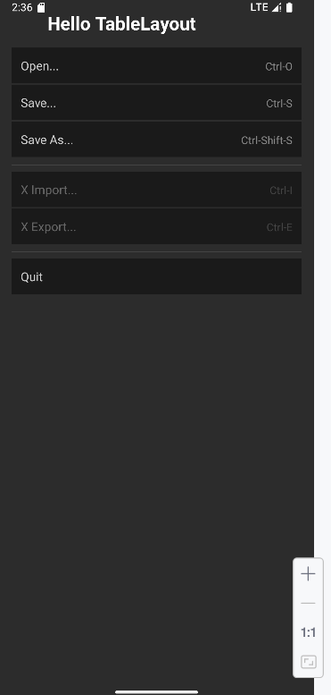
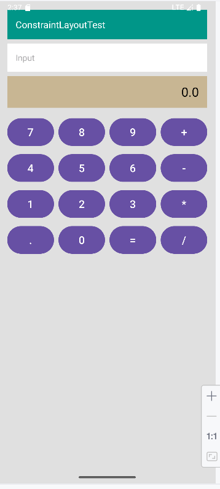
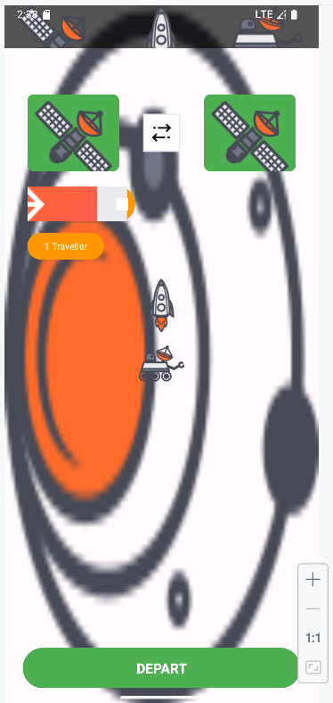
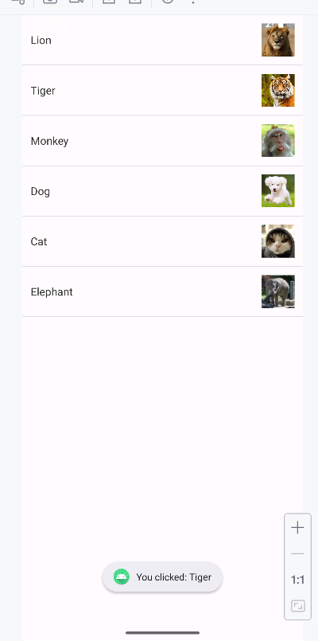
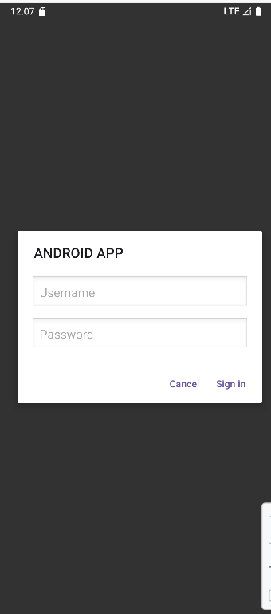
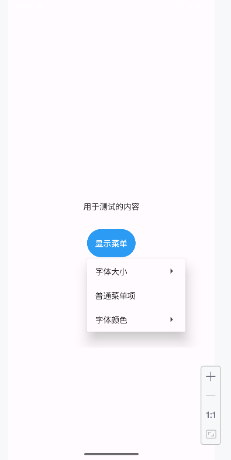
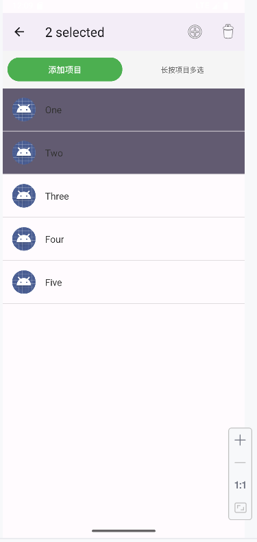

# 实验一
## 完成androidStudio的安装
1.通过官网下载了androidStudio
2.安装完成之后，打开androidStudio，点击create new project，创建一个项目

3.创建完成后，通过繁琐的下载依赖和与gradle很长一段时间的斗智斗勇，最后选择了下载gradle的完整资源包替换文件，第一次运行了项目

- - -

# 实验二
## Android布局实验

### 1. LinearLayout - 4x4网格布局
1. 创建了LinearLayoutActivity和对应的xml布局文件
2. 使用嵌套的LinearLayout实现4x4网格，外层垂直排列，内层水平排列
3. 通过layout_weight="1"让每个格子均匀分布，实现了类似表格的效果

### 2. TableLayout - 菜单界面
1. 创建了TableLayoutActivity，使用TableLayout实现菜单布局
2. 每个TableRow代表一行菜单项，里面放置了菜单名称和快捷键两个TextView
3. 用stretchColumns="0"让第一列自动拉伸，快捷键右对齐，看起来比较整齐
4. 中间加了分割线View，让菜单分组更明显

### 3. ConstraintLayout - 计算器界面
1. 第一次用ConstraintLayout，一开始约束关系搞得有点乱
2. 后来发现用链(Chain)可以让按钮均匀分布，4x4的按钮网格就搞定了
3. 给计算器加了简单的计算逻辑，点击按钮能实际计算，感觉还挺有成就感的

### 4. ConstraintLayout - 太空站界面
1. 这个界面比较复杂，用了各种图片资源
2. DCA和MARS两个站点通过约束定位，中间用双向箭头连接
3. 加了火箭和漫游车的图标装饰，还有银河背景，视觉效果拉满
4. 调整各个元素的大小和位置花了不少时间，最后效果泰拉跨了，我真尽力了

### 总结
通过这次实验掌握了Android的三种主要布局方式。LinearLayout简单直观但嵌套多了性能差，TableLayout适合表格数据，ConstraintLayout虽然上手难度大一点，但是真的很强大，以后应该会经常用。

# 实验三
## ListView、Dialog和菜单实验

### 1. ListView with SimpleAdapter - 动物列表
1. 用SimpleAdapter实现ListView，展示了6种动物
2. 准备了两个数组，一个存动物名字，一个存图片资源ID
3. 点击列表项会弹出Toast显示选中的动物
4. 图片都是真实的动物图片，效果挺好看的

### 2. AlertDialog - 自定义登录对话框
1. 创建了一个自定义布局的AlertDialog
2. 用setView()添加了用户名和密码输入框
3. 点击按钮弹出对话框，输入信息后点Sign in会显示用户名

### 3. XML菜单 - PopupMenu实现
1. 开始用的是Options Menu，但右上角的三个点看不到
2. 改成了PopupMenu，添加了一个按钮触发
3. 菜单里有字体大小、颜色选项，点击可以改变测试文字样式

### 4. ActionMode - 上下文操作菜单
1. 实现了ListView的多选模式，长按进入ActionMode
2. 选中后顶部会显示选中数量，还能批量删除
3. 额外添加了"添加项目"功能，可以动态增加列表内容

### 总结
这次实验主要学会了Android的UI组件使用。SimpleAdapter比ArrayAdapter功能更强，可以绑定多种数据。AlertDialog的自定义布局很实用。菜单有多种实现方式，PopupMenu比较灵活。ActionMode适合批量操作，用户体验比较好。

---